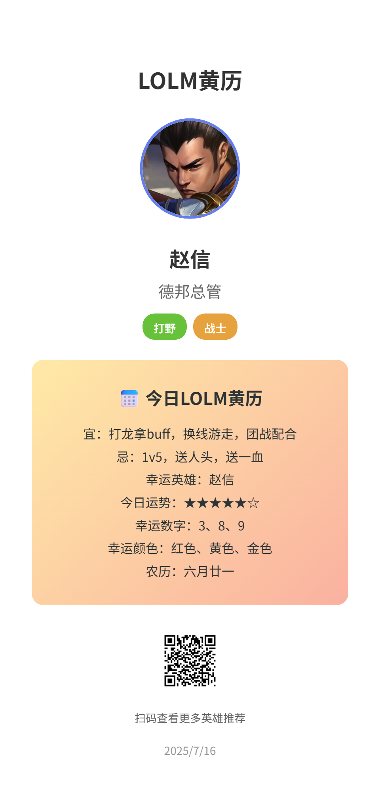
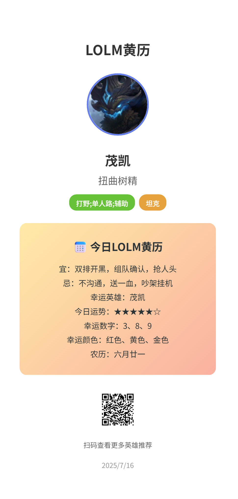

# 英雄联盟手游每日英雄推荐卡片 - Vue3版本

使用Vue3 + Element Plus重构的英雄联盟手游每日英雄推荐卡片，具有更好的用户体验和现代化的界面。

## 🚀 新特性

- **Vue3 Composition API** - 更清晰的代码结构
- **Element Plus** - 美观的UI组件库
- **响应式设计** - 完美适配各种屏幕
- **加载动画** - 更好的用户体验
- **错误处理** - 完善的错误提示
- **实时刷新** - 一键更换推荐英雄
- **现代化构建** - 使用Vite构建工具

## 📦 技术栈

- **Vue 3.4** - 渐进式JavaScript框架
- **Element Plus 2.4** - Vue3组件库
- **Vite 5.0** - 现代化构建工具
- **html2canvas** - 图片导出功能
- **qrcode-generator** - 二维码生成

## 🛠️ 安装和运行

### 安装依赖
```bash
npm install
```

### 开发环境
```bash
npm run dev
```
访问 http://localhost:3000

### 生产构建
```bash
npm run build
```

## 📁 项目结构

```
├── public/
│   ├── hero.json          # 英雄数据
│   └── almanac.json       # 黄历数据
├── src/
│   ├── components/        # 可复用组件
│   ├── utils/            # 工具函数
│   │   └── dataLoader.js # 数据加载工具
│   ├── App.vue           # 主组件
│   └── main.js           # 入口文件
├── package.json          # 项目配置
├── vite.config.js        # Vite配置
└── index.html           # HTML模板
```

## 🎯 功能说明

### 数据加载
- 异步加载英雄数据和黄历数据
- 支持离线备用数据
- 错误处理和用户提示

### 英雄展示
- 随机选择英雄展示
- 显示英雄头像、名称、称号
- 英雄经典语录展示

### 黄历功能
- 游戏化黄历内容
- 宜忌事项的游戏术语转换
- 幸运数字和颜色显示

### 导出功能
- 一键导出PNG图片
- 高质量图片输出
- 移动端适配

## 🎨 界面特色

- **渐变背景** - 美观的渐变色彩
- **卡片设计** - 现代化的卡片布局
- **响应式** - 完美适配手机和平板
- **动画效果** - 流畅的过渡动画
- **中文优化** - 专为中文用户设计

### 显示效果




## 🔧 自定义扩展

### 添加新英雄
在 `public/hero.json` 中添加新的英雄数据：

```json
{
  "heroId": 10001,
  "name": "英雄名称",
  "title": "英雄称号",
  "avatar": "头像URL",
  "introShort": "经典语录"
}
```

### 扩展黄历数据
在 `public/almanac.json` 中添加新的日期数据：

```json
{
  "2025": {
    "7": {
      "16": {
        "lunarDate": "六月廿一",
        "suitableActivities": ["开业", "结婚"],
        "unsuitableActivities": ["动土", "安葬"],
        "luckyNumbers": [3, 8, 9],
        "luckyColors": ["红色", "黄色"]
      }
    }
  }
}
```

## 📱 浏览器支持

- Chrome 90+
- Firefox 88+
- Safari 14+
- Edge 90+
- 移动端浏览器

## 🚀 部署

构建后的文件在 `dist/` 目录，可以直接部署到任何静态文件服务器：

```bash
npm run build
# 将 dist/ 目录上传到服务器
```

## 📝 开发说明

### 组件结构
- `App.vue` - 主应用组件
- `dataLoader.js` - 数据加载工具
- 使用Composition API编写
- 响应式数据管理

### 样式系统
- 使用CSS变量
- 响应式断点
- 移动端优先设计

## 🤝 贡献

欢迎提交Issue和Pull Request来改进这个项目！
